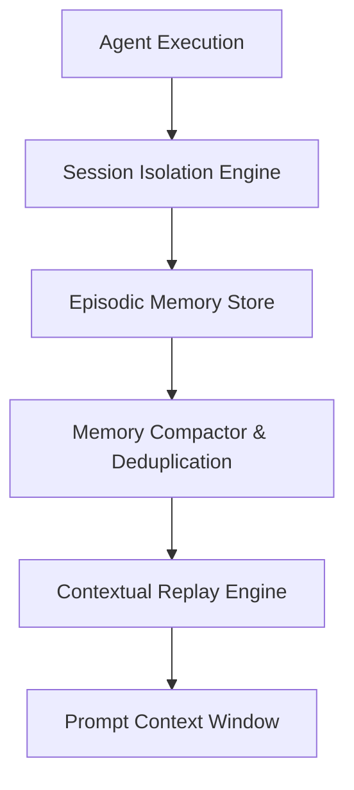

# Architecture: Ayeixa Agent Memory Spine

## Overview
Memory Spine manages agent state persistence, strict tenant boundary enforcement, and context compression.

## System Topology

```mermaid
flowchart TD
    Agent["Agent Execution"] --> Isolator["Session Isolation Engine"]
    Isolator --> Store["Episodic Memory Store"]
    Store --> Compactor["Memory Compactor & Deduplication"]
    Compactor --> Replay["Contextual Replay Engine"]
    Replay --> Context["Prompt Context Window"]
```
